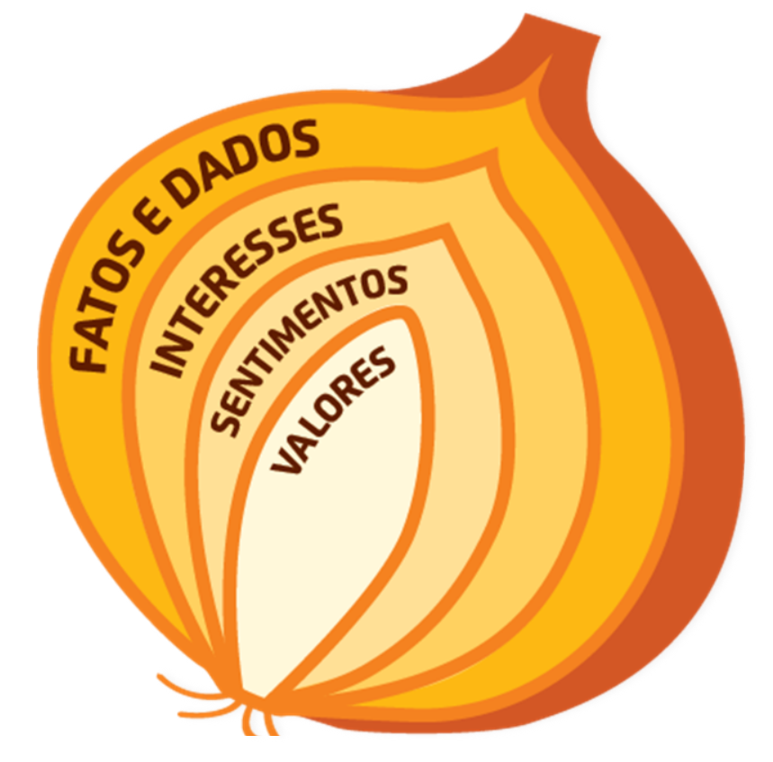
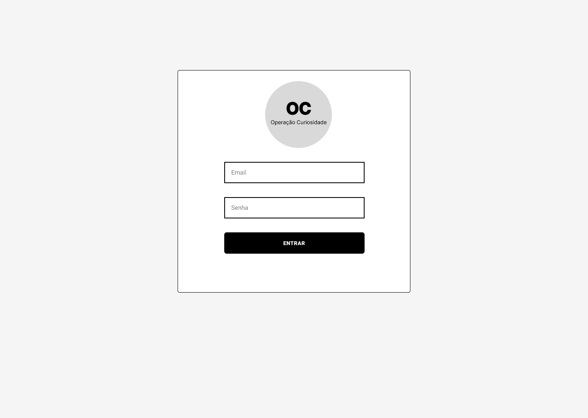
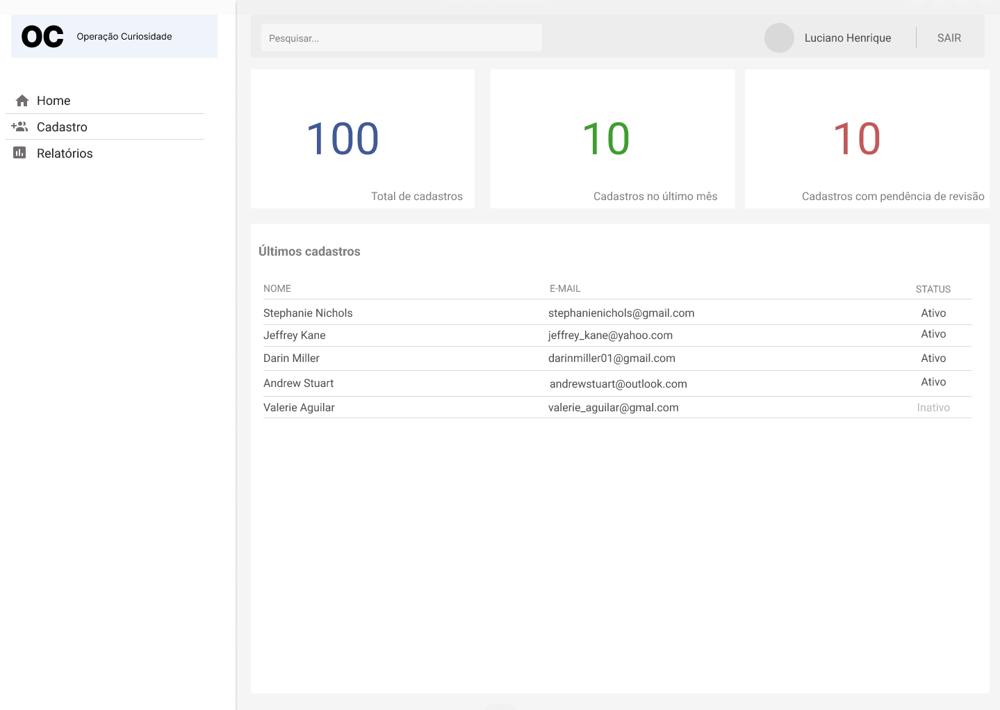

<h1>🧅 Projeto: Operação Curiosidade 🧅 </h1>
<2h> <kbd>🚧 EM DESENVOLVIMENTO 🚧</kbd></h2>  

Acesse a página! [Clique aqui👆](https://devfabiomats.github.io/projeto-operacao-curiosidade/pages/tela-login.html)  
Login: fabio@gmail.com  
Senha: 123

  <table>
        <tr>
            <td>
                
            </td>
            <td>
                <b>Objetivo:</b>
                
Desenvolver uma interface onde seja possível administrar as informações da Operação Curiosidade feita com alguém, permitindo que o usuário consiga ter uma visão geral sobre uma determinada pessoa quando quiser.

            </td>
        </tr>
    </table>

<h2>⚙️ Protótipo</h2>

<table>
    <tr>
        <td>
            
        </td>
        <td>
            
        </td>
    </tr>
</table>    

'Operação Curiosidade'  
Disponível em: [Link do protótipo no Figma](https://www.figma.com/proto/wfbS3foknx3oKuguBUlkRa/Opera%C3%A7%C3%A3o-Curiosidade?node-id=0%3A1&scaling=min-zoom&page-id=0%3A1&starting-point-node-id=0%3A3)

<h2>⚙️ Tecnologias utilizadas</h2>

  - HTML5
  - CSS3
  - JavaScript
  - Github