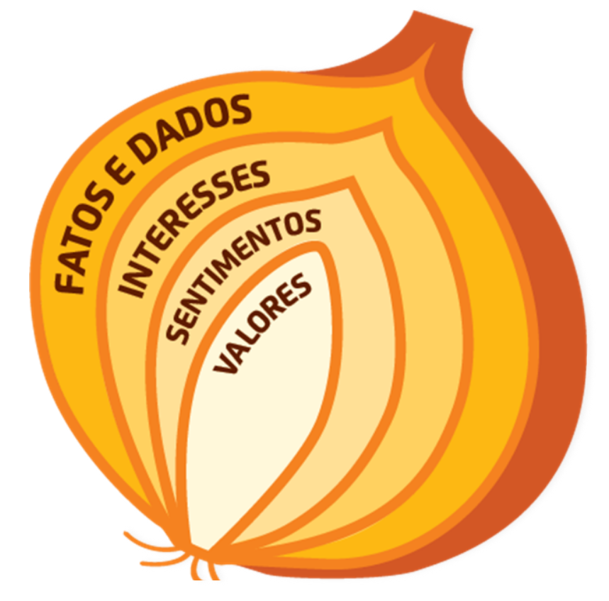

<h1>🧅 Projeto: Operação Curiosidade 🧅 
<H2> <kbd>🚧 EM DESENVOLVIMENTO 🚧</kbd>  

  <table>
        <tr>
            <td>
                
            </td>
            <td>
                <b>Objetivo:</b>
                
Desenvolver uma interface onde seja possível administrar as informações da Operação Curiosidade feita com alguém, permitindo que o usuário consiga ter uma visão geral sobre uma determinada pessoa quando quiser.

            </td>
        </tr>
    </table>

<h2>🖼️ Protótipo</h2>

'Operação Curiosidade'  
Disponível em: https://

<h2>⚙️ Tecnologias utilizadas</h2>

  - HTML5
  - CSS3
  - JavaScript
  - Github